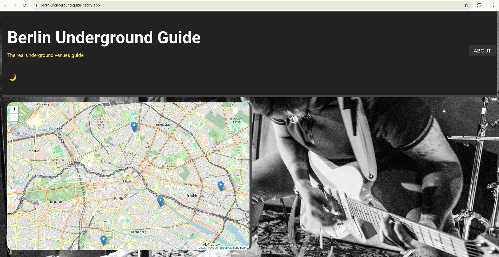

# Berlin Underground Guide

## Overview
Created an interactive map guide showcasing the underground music venues in Berlin, focusing on basements and hidden spots as part of my JavaScript final project for the ReDi School of Digital Integration. This app uses Leaflet.js for the map interface and includes custom features like dark/light mode toggle, venue information modals, and interactive pins.

### The challenge

Users should be able to:

- Explore underground music venues on an interactive map.
- Click on venue pins to view more details (name, description, image, and website).
- Toggle between dark and light modes.
- View an "About" modal with background information about the project.

### Screenshot

### Links

- Solution URL: [GitHub Repository](https://github.com/Lilian-CR/Berlin-Underground-Guide)
- Live Site URL: [Berlin Underground Guide Live Site](https://berlin-underground-guide.netlify.app/)

## Process

- Designed the layout and user interface using HTML, CSS, and JavaScript to create an engaging experience for visitors.
- Integrated Leaflet.js to display the map and placed interactive markers for each venue.
- Developed the dark/light theme toggle to enhance user experience with smooth transitions.
- Created modals for displaying venue information, including image, description, and links to websites.
- Set up event listeners for smooth interaction, including clicking on markers and opening modals.
- Ensured responsiveness across mobile and desktop platforms by using flexible CSS grid and media queries.
- Designed custom background and design elements to reflect the underground vibe of the venues.
- Added a fun "About" section with credits and project details, accessible via a button in the header.

### Coded with:

- HTML
- CSS
- JavaScript (Leaflet.js for map)
- Responsive mobile & web design

### Resources

- Leaflet.js - [Leaflet Documentation](https://leafletjs.com/)
- FontAwesome - [FontAwesome Icons](https://fontawesome.com/)
- Background Image - Photo credit to Oyèmi Noize/No Heroes IG - [Instagram](https://www.instagram.com/noheroes.jpg/)
